# Keystone 多级租户能力分析（legacy）

## 调研背景

​	来源：之前在各项目招标中，常见有关多VDC及多级租户等业务诉求，需要对支持度进行摸底。

​	目的：验证Keystone 多级租户能力，是否支持类似“省市县”的多级结构。

​	版本：Mitaka​

## 验证步骤

### 1. 准备两个租户：

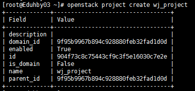

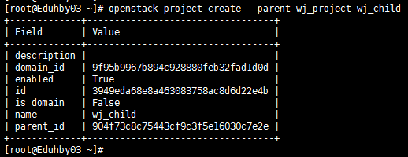

可见，租户默认domain为同一个。且：

1. 无父租户的Project，其父租户是默认domain；
2. 有父租户的Project，其父租户是指定的父租户。

### 2. 分别在两个租户内创建两个用户：

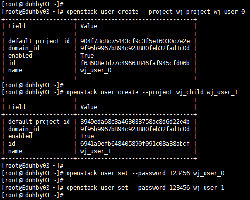

### 3. 设置角色：

在创建角色时，可通过指定是否角色继承，来使父租户用户的角色直接继承到子租户中。

指定父租户的用户为admin，同时在子租户内也是admin角色。

**注意**：如果在父租户授权时，不指定"inherited"，而是手动再指定该用户在子租户内权限的话，则查看角色时将形如以下形式，即**最后父子租户的"Project"字段中将对应不同租户ID——但在后续测试中，未发现实际区别**：

### 4. 设置父租户的配额：

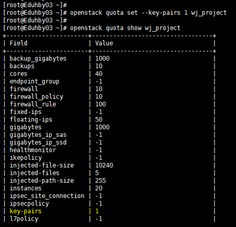

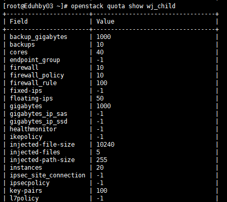

将父租户的keypair 配额限定为1。而子租户keypair配额保持100不变。

### 5. 在子租户内创建资源：

先使用父租户管理员用户，在子租户内尝试创建keypair：

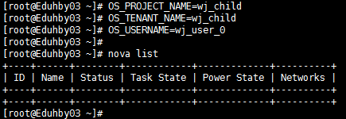

在子租户内创建两个keypair，结果成功。——**似乎说明子租户的资源与父租户独立，父租户配额限制不影响子租户。**

### 6. 在父租户内创建资源：

切换回父租户，重新创建keypair：

在父租户内创建keypair，直接提示配额不足。且通过查询接口，在父租户内能够查询到之前父租户管理员用户在子租户内创建的两个keypair。——从结果来看，**似乎说明父租户的资源配额，是会包括子租户资源的。**

### 7. 扩容父租户的配额，测试父租户能否为自身再预留部分资源：

首先将父租户配额修改为3：

在父租户内创建keypair：

再次创建第二个keypair 就会提示超过配额。调用查询接口，可以看到当前能够查到的keypair为3，符合配额限制：

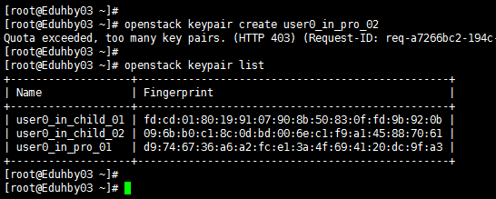

### 8. 疑问：

根据上文测试结果，总结下上面的判断行为为：

1. 父租户配额不影响子租户配额；
2. 而子租户配额，却会影响父租户配额。

不过仔细想想，这里是**只"底层影响上层的配额"，感觉和一般理解的控制流方向相反，逻辑似乎不太对？**

### 9. 回到子租户，切换子用户重新创建：

回到我们的测试场景。

先删掉之前父租户管理员用户在子租户内创建的keypair。之后回到子租户，切换到子租户管理员用户来重新测试：

重新在子租户内创建两个keypair：

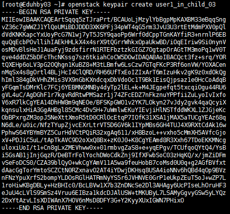

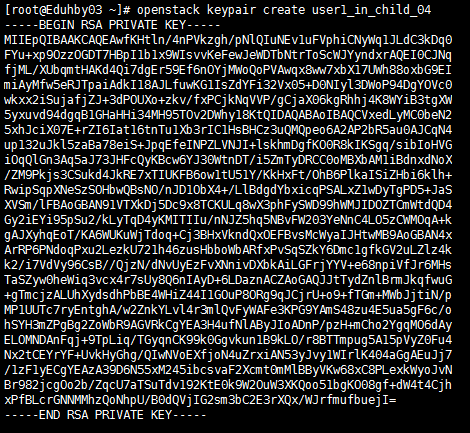

### 10. 在父租户内再次创建：

接着，我们回到父租户用户，再次查看下当前父租户资源用量。见下图，可见当前仅能看到最开始父用户自己创建的一个keypair，而子用户刚在上一步创建的两个keypair 却看不到了：

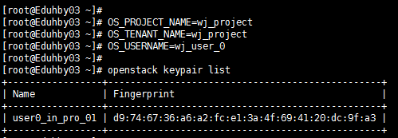

陆续创建两个keypair后，再创建第三个后才提示失败，满足配额预期。

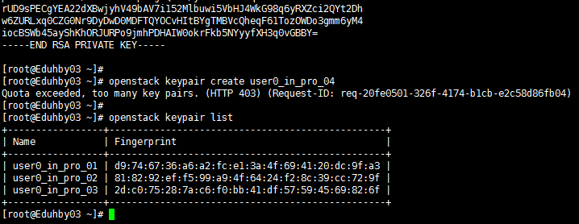

### 11. 再次总结：

综上，第二次与第一次的结果，似乎截然相反。**按照这次的测试结论，应该是"父子租户间配额互不影响，彼此独立"。**看上去，似乎第二种更符合逻辑些。

***那么，这里究竟哪种正确呢？***

### 12. 释疑：

这里解释下，为何会出现以上两种现象。

答案其实是，keypair在Nova中是按照用户名来查询，而不是租户。因此：

在第一次中：

1. 用父用户在子租户内创建资源时，实际统计时是采用发送消息的租户来判断配额的，即子租户配额，由于默认值是100，因此不会超配；
2. 而在回到父租户时，再次判断配额时就会提示配额已满，因为父租户的配额仅为1。

 而在第二次：

1. 由于直接使用的是子租户创建的keypair，在回到父租户中查询时使用父用户查询，是查询不到的，因此也不会占用父租户的配额；
2. 直到父用户本身在父租户中创建的keypair超过配额，才会报错。

综上，归根结底，以上现象是由于keypair 在Nova中的特殊性造成的。

其实，对于虚拟机等普通对象来说，**父子租户间的配额都是互不影响，彼此独立的。**

## 社区现状：

说到这里，就顺便聊聊Keystone社区有关多级租户的发展现状。

### Keystone多级租户支持

有关Keystone多级租户设置，以Domain-Project 为基本结构的嵌套模型，租户权限部分已经实现：

1. 权限分层之前早已完成：[https://blueprints.launchpad.net/keystone/+spec/hierarchical-multitenancy](https://blueprints.launchpad.net/keystone/+spec/hierarchical-multitenancy)
2. 顶级Project 作为Domain，Mitaka已实现：[https://blueprints.launchpad.net/keystone/+spec/reseller](https://blueprints.launchpad.net/keystone/+spec/reseller)
3. Horizon 支持，近期也已标示为完成：[https://blueprints.launchpad.net/horizon/+spec/hierarchical-projects-and-inherited-assignments](https://blueprints.launchpad.net/horizon/+spec/hierarchical-projects-and-inherited-assignments)

### 各组件的多级租户支持

而我们最关心的，各大组件配额嵌套的问题，其实社区之前就将BP同步给各个组件了。不过当前仅Cinder完成了，Nova的代码几个版本都没提进去，而其余模块甚至都还没开始动（注：有兴趣可以去社区做贡献）。具体信息汇总如下：

1. [https://blueprints.launchpad.net/nova/+spec/nested-quota-driver-api](https://blueprints.launchpad.net/nova/+spec/nested-quota-driver-api)
2. [https://blueprints.launchpad.net/cinder/+spec/cinder-nested-quota-driver](https://blueprints.launchpad.net/cinder/+spec/cinder-nested-quota-driver)
3. [https://blueprints.launchpad.net/keystone/+spec/reseller](https://blueprints.launchpad.net/keystone/+spec/reseller)
4. [https://blueprints.launchpad.net/glance/+spec/nested-quota](https://blueprints.launchpad.net/glance/+spec/nested-quota)
5. [https://blueprints.launchpad.net/neutron/+spec/nested-quota-driver](https://blueprints.launchpad.net/neutron/+spec/nested-quota-driver)

### Keystone多级租户的后续计划

此外，有关分级管理的其他功能，Keystone在Ocata版本的规划如下，此处一并附上：

1. Domain分级，Spec 需重新提交：[https://blueprints.launchpad.net/keystone/+spec/hierarchical-domains](https://blueprints.launchpad.net/keystone/+spec/hierarchical-domains)
2. Project 递归删除/禁用，实现中：[https://blueprints.launchpad.net/keystone/+spec/project-tree-deletion](https://blueprints.launchpad.net/keystone/+spec/project-tree-deletion)
3. 子租户是否继承Parent，Spec 修改中：[https://blueprints.launchpad.net/keystone/+spec/inherit-from-parent](https://blueprints.launchpad.net/keystone/+spec/inherit-from-parent)

## 结论

1. Keystone 在Mitaka版本已支持多级租户设置；能够在用户授予角色时，指定父租户角色是否继承至子租户内；

2. 但多级各租户间的配额关联还未实现，父子租户间配额独立；

3. 因此，若想实现类似"省市县"的多级管理，且要求配额统分功能的话；**在不修改Keystone代码的前提下**，建议采用如下方式实现：

   1. Portal 独立控制：各租户配额在OpenStack各组件层面放开；
      - 优点：更灵活，与OpenStack解耦，后续社区补完后易于切换；
      - 缺点：
        - Portal 需独立维护配额信息；
        - 无法支持API等对接方式，功能特性需与Portal 配合实现。
   2. 配额由各组件控制：各子租户独立发放业务，父租户单独指定本租户内的配额（不包括子租户的）能够使用的：
      - 优点：
        - Portal 无需维护配额信息，与OpenStack解耦；
        - 部署简单，结构清晰；子租户扩容时无需修改父租户配额；
      - 缺点：
        - 父租户配额无法显示子租户配额之和。
   3. 基本方案同方案2，只是(父租户配额) = (子租户配额之和 + 父租户本身配额)：
      - 优点：
        - Portal 无需维护配额信息，与OpenStack解耦；
        - 父租户配额能够直接显示整个上下级组织的配额总数，父子租户间资源无实际隔离，利用率高；
      - 缺点：
        - 部署时稍显复杂，后续子租户扩容时需同步配额改动到父租户；
        - 且由于租户间其实未实现真正的资源配额隔离，因此当父租户如果占用过多资源时，各子租户资源将无法达到预先计划的配额值（即比各自配额实际承诺的少了）。
   4. 配额仍由各组件控制：但在父租户中专门创建一特权用户，该用户在父租户内无操作权限，但在各个子租户内可操作资源用于发放业务。之后按照"省市县"实际资源要求，保证各子租户配额之和，不超过父租户配额即可：
      - 优点：
        - Portal 无需维护配额信息，与OpenStack解耦；
        - 父租户配额能够直接显示整个上下级组织的配额总数，父子租户间资源无实际隔离，利用率高；
      - 缺点：
        - 部署时配置困难，后续子租户扩容时得同步修改父租户内配额；
        - 另外各个租户都需使用该租户发放业务，会约束交付场景；
        - 在子租户中使用该用户查询Keypair时，会查到其他该特权用户在其他租户中创建的Keypair；
        - 且由于租户间其实未实现真正的资源配额隔离，因此当父租户如果占用过多资源时，各子租户资源将无法达到预先计划的配额值（即比配额实际承诺的少了）。

4. 鉴于后续社区发展和现状分析，**个人更推荐方案二和方案一**。

   ​
